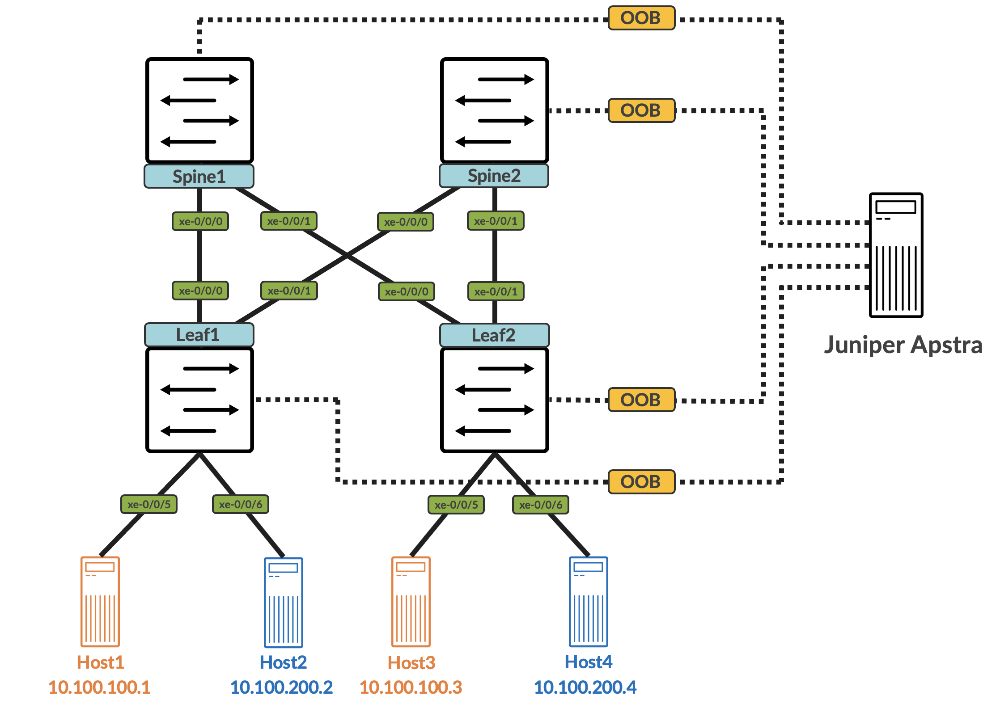

This repo is an example that showcases how to use Juniper Apstra Freeform for a 2 leaf, 2 spine CRB data center deployment model. All fabric devices are Juniper vQFX, running 19.4. The topology is as follows:

